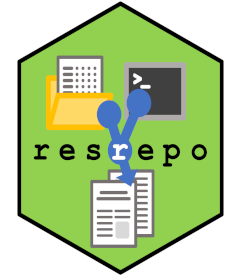

# resrepo 

<!-- badges: start -->
  [](https://github.com/EvolEcolGroup/resrepo/actions/workflows/R-CMD-check.yaml)
  <!-- badges: end -->

# Research repository (resrepo) template

The aim of `resrepo` is to encourage and facilitate good practices when setting up and managing `git` repositories for scientific research projects. Scientific projects contain both code and data. `git` is designed to manage software code, but it is not suited to track large data files. There are extensions of `git`, such as `git-lfs` and `git-annex` that can handle data, but they can be complex to set up and difficult to use, especially when sharing your repository among collaborators. `resrepo` encourages good habits to manage your data alongside your code in plain `git`, ensuring reproducible science and a tidy repository that can used for publication of your project.

## Install the library

You will need to install the library from GitHub. For this step, you will need to
use `devtools` (if you haven't done so already, install it from CRAN with `install.packages("devtools")`.
Once you have `devtools`, simply use:
```
devtools::install_github("EvolEcolGroup/resrepo")
```


## Overview of functionality

You can build the vignettes when installing 
`resrepo` (note that you will need to have the necessary tools to build vignettes already installed;
requirements depend on your OS):
```
devtools::install_github("EvolEcolGroup/resrepo", build_vignette = TRUE)
```
If you built the vignettes, you can read them directly in R. For example, the overview of the workflow can be
obtained with:
```
vignette("workflow", package = "resrepo")
```
