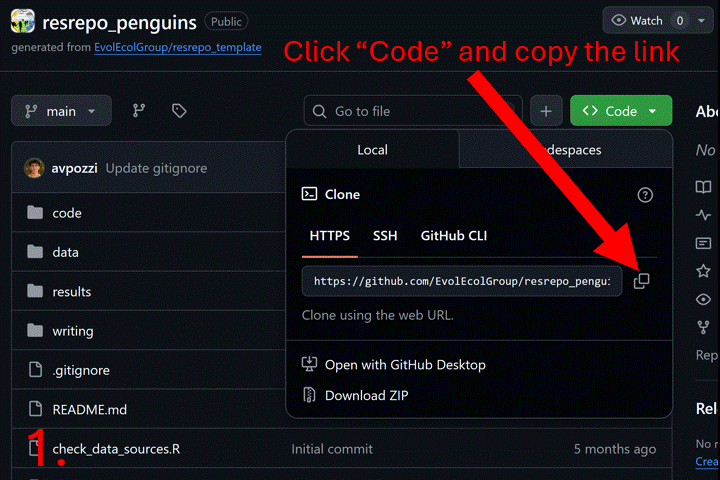

# Sharing a resrepo repository

This vignette explains how to share a `resrepo` repository, either with
collaborators (or anyone who will work on it) or with the public, for
example as part of a publication.

When sharing with collaborators, they will simply need to:

1.  Clone the `resrepo` repository
2.  Obtain the data they need
3.  And set up symlinks to the location of the data

When sharing with the public or with reviewers, you will additionally
need to:

4.  Upload the data to a publicly available location (e.g. Zenodo,
    Dryad, OSF, etc..)
5.  Provide a script that downloads the data automatically.

## 1 & 2. Cloning a `resrepo` repository and downloading data

The following GIF shows how to clone a `resrepo` repository using GitHub
and RStudio.



You’ve cloned a `resrepo` repository with code, but the data required
for the analyses are located elsewhere, outside the cloned repository.

``` r
fs::dir_tree()
#> .
#> ├── README.md
#> ├── check_data_sources.R
#> ├── code
#> │   ├── README.md
#> │   ├── s01_download_penguins.Rmd
#> │   ├── s02_merge_clean.Rmd
#> │   └── s03_pca.Rmd
#> ├── data
#> │   ├── README.md
#> │   ├── archive
#> │   │   └── README.md
#> │   ├── data_sources.csv
#> │   └── version_meta
#> │       ├── initial.meta
#> │       ├── intermediate_in_use.meta
#> │       ├── raw_in_use.meta
#> │       └── starting.meta
#> ├── resrepo_manual.md
#> ├── results
#> │   └── README.md
#> └── writing
#>     └── README.md
```

As you can see from the above tree, `data` is an empty folder, this is
because no data are stored in the repository.

Therefore, you need to take two steps:

- Download the data from where they are stored and place them in a
  location of your choice (e.g. a folder on your local machine, a synced
  folder, etc..)
- Set up the symlinks to point to the location of the data you just
  downloaded

Moreover, as you can see, this repository contains the folder
`version_meta` which indicates to us that this repository has been
versioned. If you are not familiar with the concept of versioning,
please check the `data versioning` vignette.

As an example, we will create a directory to act as our external data
storage folder. Note that we we are creating this folder in the
temporary directory, but you should choose a location anywhere on your
local machine. We will call this folder `external_data_storage_new`.

``` r
# create new external folder for data
external_data_storage_new <- file.path(tempdir(), "external_data_storage_new")
dir.create(external_data_storage_new)
```

It is important that the external data folder where you store your data
is structured in the exact same way as your `data` folder within your
`resrepo` repository. Otherwise `resrepo` will not be able to find the
files.

Ideally, the directory structure of the data shared with you for this
project should already match the structure of the `data` folder in the
repository. Check with the person who shared the repository with you if
you are unsure about this.

In the following example, we will create the substructure of the `data`
folder, which contains `starting/raw` and `initial/intermediate`
directories,

``` r
intermediate_path <- file.path(tempdir(),
                               "external_data_storage_new/initial/intermediate")
raw_path <- file.path(tempdir(), "external_data_storage_new/starting/raw")
dir.create(intermediate_path, recursive = TRUE)
dir.create(raw_path, recursive = TRUE)
```

And then we will copy the raw data into
`external_data_storage_new/starting/raw`:

``` r
file.copy(
  from = system.file("vignette_example/tux_measurements.csv",
                     package = "resrepo"),
  to = raw_path,
  overwrite = TRUE
)
#> [1] TRUE
```

## 3. Setting up symlinks to data

If you have a repository that is not versioned (it does not contain any
version.meta), then you can simply link your external data storage
location to the `data` folder in your repository using the
`data_dir_link` function:

Because this repository has been versioned, we need to set up versioning
in our local repository. Now that our `external_data_storage_new` folder
contains the data, we can do this using `version_setup`.

We need to supply the argument `resources_path` to `version_setup`,
which is the path to the external data storage folder:

``` r
version_setup(quiet = TRUE, resources_path = external_data_storage_new)
#> [1] TRUE
```

``` r
fs::dir_tree()
#> .
#> ├── README.md
#> ├── check_data_sources.R
#> ├── code
#> │   ├── README.md
#> │   ├── s01_download_penguins.Rmd
#> │   ├── s02_merge_clean.Rmd
#> │   └── s03_pca.Rmd
#> ├── data
#> │   ├── README.md
#> │   ├── archive
#> │   │   └── README.md
#> │   ├── data_sources.csv
#> │   ├── intermediate
#> │   ├── raw
#> │   └── version_meta
#> │       ├── initial.meta
#> │       ├── intermediate_in_use.meta
#> │       ├── raw_in_use.meta
#> │       └── starting.meta
#> ├── resrepo_manual.md
#> ├── results
#> │   └── README.md
#> ├── versions
#> └── writing
#>     └── README.md
```

We can now see that we have `data/intermediate` and `data/raw` folders.
These are both links which point to the `versions` folder, and
`versions` points to our external data storage (easy isn’t it!);

data/intermediate -\> versions -\>
external_data_storage_new/initial/intermediate data/raw -\> versions -\>
external_data_storage_new/starting/raw

We can also check the structure of the `external_data_storage_new`
folder:

``` r
fs::dir_tree(external_data_storage_new)
#> /tmp/Rtmpc0NHS7/external_data_storage_new
#> ├── initial
#> │   └── intermediate
#> └── starting
#>     └── raw
#>         └── tux_measurements.csv
```

## 4. Downloading data from a public location

If you are sharing your repository with the public, you will need to
upload your data to a publicly available location (e.g. Zenodo, Dryad,
OSF, etc..) and provide a script to download the data. You may also
require data from other public repositories (e.g. GBIF, GenBank, etc..).
The script to download the data should be placed in the `code` folder of
your `resrepo` repository, and should ideally be named
`s0_download_data.Rmd`. It should download all the data from the
different sources and place them in the appropriate directory (see
Section 2 above).

After doing so, you can then use `version_setup` to set up the symlinks
to the data as shown in Section 3 above.

You can find an example of an `s0_download_data.Rmd` in the
`inst/vignette_example` folder of the `resrepo` package or see the code
below:

``` r
# First, we will create an external data folder to store
# the data and will link to it from the `data/raw` folder.
# You can see how to do this in the `sharing_resrepo` vignette.

# create new external folder for data
external_data_storage_review <- file.path(tempdir(),
                                          "external_data_storage_review")
dir.create(external_data_storage_review)

# load inborutils to download from zenodo
library(inborutils)

# download data from zenodo
doi <- "10.5281/zenodo.17287488"
inborutils::download_zenodo(doi, external_data_storage_review, quiet = TRUE)

# Now we can see that the files have been downloaded to
# our external data folder.
list.files(external_data_storage_review)
```
