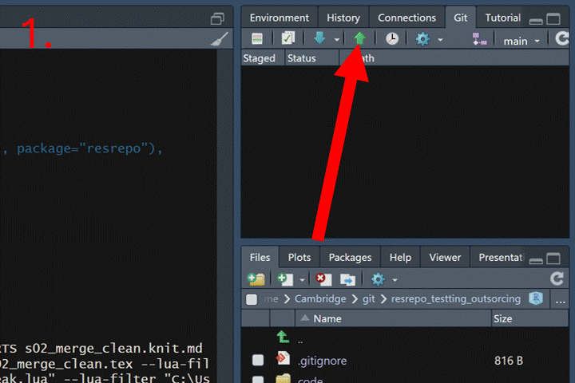
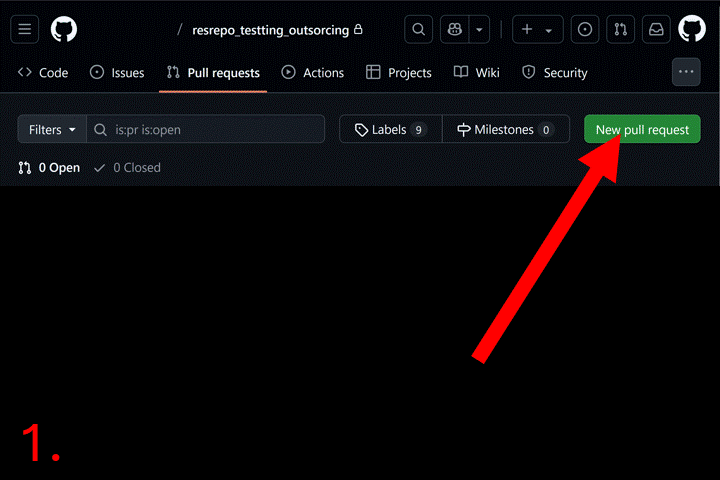

```{r setup, include = FALSE}
knitr::opts_chunk$set(
  collapse = TRUE,
  comment = "#>"
)
example_dir <- file.path(tempdir(),"resrepo_example")
unlink(example_dir,recursive = TRUE)
dir.create(example_dir, showWarnings = FALSE)
example_repo <- git2r::init(example_dir, branch = "main")
git2r::config(example_repo, user.name = "Test", user.email = "test@example.org")
vignette_dir<-getwd()
knitr::opts_knit$set(root.dir = example_dir)
example_dir
```

In many scientific projects, data are simply too large to be stored in a git repository. 
However, you still want to keep track of the data you used for your analysis, and often you will
be using different code branches to explore alternative approaches (e.g. different data filtering).
`resrepo` allows you to create versions of the data directories used in your projects, 
allowing you to easily switch between different versions of the data.

# Setting up data versioning

Let us start by recreating the example repository. This is the same repository
we created in vignette `workflow`; if you still have that repository, you don't need to run the code below:

```{r recreate_example_repo, results='hide'}
library(resrepo)
init_resrepo()
file.copy(from = system.file("vignette_example/tux_measurements.csv", package="resrepo"),
          to = path_resrepo("/data/raw/original/tux_measurements.csv"),
          overwrite = TRUE)
file.copy(from = system.file("vignette_example/s01_download_penguins.Rmd", package="resrepo"),
          to = path_resrepo("/code/s01_download_penguins.Rmd"),
          overwrite = TRUE)
knit_to_results(path_resrepo("/code/s01_download_penguins.Rmd"))
file.copy(from = system.file("vignette_example/s02_merge_clean.Rmd", package="resrepo"),
          to = path_resrepo("/code/s02_merge_clean.Rmd"),
          overwrite = TRUE)
knit_to_results(path_resrepo("/code/s02_merge_clean.Rmd"))
file.copy(from = system.file("vignette_example/s03_pca.Rmd", package="resrepo"),
          to = path_resrepo("/code/s03_pca.Rmd"),
          overwrite = TRUE)
knit_to_results(path_resrepo("/code/s03_pca.Rmd"))
git2r::add(path=".")
git2r::commit(message="Set up", all=TRUE)

```

Let us check that we do have indeed a full repository:
```{r check_if_full_repo, echo=TRUE}
fs::dir_tree()
```


When we want to start versioning the data, we can use the function `version_setup`. We only need to use the function once at the beginning of the project to initialise versioning. 
You can specify the location of your data using the `resources_path` argument. 
The function will create a subfolder named `versions` in this location.
By default, this will end into your repository, but it doesn't have to, and it can
be located anywhere on your system.
```{r version_setup}
version_setup(quiet = TRUE, resources_path = NULL)

```

Let us check what happened:
```{r check_version_setup, echo=TRUE}
fs::dir_tree()
```

We can see that both `data/raw` and `data/intermediate` have been moved into `versions`, `intermediate` is under the `initial` version, while `raw` is under the `starting` directory.
In this vignette, we will be focusing only on versioning `data/intermediate`. Advanced users
can also version `data/raw` but that will be covered in vignette @TODO. For now, 
`raw_in_use.meta` will point to the starting version of `data/raw` and will not change.

`data/intermediate` and `data/raw` have now become links, which is why they are highlighted in a different colour (light purple) in the tree above. We can use these links as if they were directories, and check that they point correctly to the directories in `versions`.

TODO: Create vignette for versioning data raw.

```{r check_links}
dir(path_resrepo("/data/raw"))
```

However, note that the data are now NOT being tracked by git, as `versions` is in .gitignore. So, you want to make sure that you have a reliable way to back up your data (we provide a solution in the vignette on `Data mirroring outside a git repository`).

TODO: Create vignette for data mirroring outside a git repository.

# Adding a new version

We might now want to revise the filtering of data that we are doing. This will
affect some intermediate data and results. Whilst results are tracked in the git
repository, data are not. However, we might want to
compare the alternative filtering approaches. We can use the `version_add()` 
function to create a new version of the data, which we can modify and compare 
to the `initial` version we created earlier. It will also create a new branch in the git repository (with the same name):

```{r version_add}
version_add(intermediate_new_version = "new_filtering",
            intermediate_description = "Filtering out some data")
```

Now `data/raw` and `data/intermediate` are symlinks to the `new_filtering` 
version of the data, which is found under `versions/new_filtering`. Each version will be under a new branch of the repository.

```{r check_version_add, echo=TRUE}
fs::dir_tree()
```

Imagine that we have just been told that the first 10 measurements of the penguins
might be considered unreliable, as the scales were showing a low battery warning.
We now will edit the code that merges and cleans the data, and modify it to 
remove the first 10 penguins from the dataset. We use a pre-prepared script for this,
which we copy to the `code` directory:

```{r copy_script_clean_data}
file.copy(from = system.file("vignette_example/new_filtering/s02_merge_clean.Rmd", package="resrepo"),
          to = path_resrepo("code/s02_merge_clean.Rmd"),
          overwrite = TRUE)
```

If this was a "real" project, since the `new_filtering` version is a new branch of 
the repository, we could edit the script in the `code` directory and commit the changes.

We can now remove the full version of the intermediate dataset in the `new_filtering` folder so that we can replace it with a new version that excludes the first 10 penguins. 

```{r remove_old_version}
unlink(path_resrepo("data/intermediate/s02_merge_clean"), recursive = TRUE)
```

Note that `penguins_na_omit.csv` is still in the `versions/initial` folder, as we
have not removed it from `versions/initial` but only from the `versions/new_filtering` 
directory.

```{r check_remove_old, echo=TRUE}
fs::dir_tree()
```

If we now knit the new version of the code, where we remove the first 10 penguins, 
the data are written to the `versions/new_filtering/intermediate` directory.

```{r knit_new_filtering}
knit_to_results(path_resrepo("/code/s02_merge_clean.Rmd"))
```

```{r echo=TRUE}
fs::dir_tree()
```


We can now compare the datasets of our two versions, and we can see that our current version of
the data, which is found in `new_filtering` version, has 10 fewer penguins than the `initial`
version.

```{r compare_versions}
penguins_new_filtering <- read.csv(path_resrepo("data/intermediate/s02_merge_clean/penguins_na_omit.csv"))

penguins_initial <- read.csv(path_resrepo("/versions/initial/intermediate/s02_merge_clean/penguins_na_omit.csv"))

nrow(penguins_initial)
nrow(penguins_new_filtering)
```

# Merging back into main

If we are happy with the new version, we can merge it back into the main branch. This will mean that our branch `main` will now use the new version of the data (with the 10 less penguins). At the same time, this means that we will replace the previous code with 
the one in the new branch. You may want to keep both versions of the code if you are 
interested in using both versions of the data. 
If we are absolutely sure about merging back into the main branch, before doing it, we need to commit the changes to the branch `new_filtering`. 

How to commit in RStudio:

<div style="text-align: center; margin-top: 10px; margin-bottom: 10px;">
  
</div>

```{r git_commit, eval=T, echo=FALSE, message=FALSE, results='hide'}
# commit changes
git2r::commit(message="Filter out 10 penguins", all=TRUE)

```

Now we can merge the branch `new_filtering` into the branch `main`, and check
out `main`. To to this, we can use the GitHub interface, following the steps below.

First, we need to push both branches to GitHub:

<div style="text-align: center; margin-top: 10px; margin-bottom: 10px;">
  
</div>

Now go to your repository page on GitHub. Click the "Pull requests" tab. Then click the "New pull request" button and select base branch (e.g., `main`) and compare branch (e.g., `new_filtering`). Click "Create pull request", and add a description. Click "Merge pull request" to complete the merge. Now you can delete the `new_filtering` branch.

<div style="text-align: center; margin-top: 10px; margin-bottom: 10px;">
  
</div>

```{r git_merge, eval=T, echo=FALSE, results='hide'}
# merge in branch
system2("git", args = c("merge new_filtering"))

# checkout main
system2("git", args = c("checkout main"))

# we are still in main
git2r::is_head(git2r::branches()$main)

```


# Outsourcing the data 

```{r recreate_example_repo_02, include = FALSE}
example_dir <- file.path(tempdir(),"resrepo_example")
unlink(example_dir,recursive = TRUE)
dir.create(example_dir, showWarnings = FALSE)
example_repo <- git2r::init(example_dir, branch = "main")
git2r::config(example_repo, user.name = "Test", user.email = "test@example.org")
vignette_dir<-getwd()
knitr::opts_knit$set(root.dir = example_dir)
example_dir
```


Often, data are too big to be stored within your git repository. Therefore, we may 
want to store them into a different location: locally within your machine, in a 
hard drive, or to a folder synced to the cloud. 
In this section, we will show how to use the `version_setup` function to outsource your
data. 

Be aware that we can use the `version_setup` function only once when initializing the repository. Therefore, we need to create an empty repository: 
```{r init_resrepo, results='hide'}
init_resrepo()
```


We now need to create a folder in our desired external location.  
```{r create_external_folder, echo=TRUE}
external_data_storage <- file.path(tempdir(), "external_data_storage")
unlink(external_data_storage, recursive = TRUE)
dir.create(external_data_storage)
```


For the purpose of this vignette, the above folder is created in a temporary location.
For your project this could be a directory in your local machine, on a hard drive, or
a folder synced to the cloud.


Now we have an empty folder where we want to store our data, and an empty 
repository for our project. 
We can now use the `version_setup` function to set up the repository. 
This time we can set the argument `resources_path` to the path of `external_data_storage`.
```{r version_setup_external}
version_setup(quiet = TRUE, resources_path = external_data_storage)
```


We can now check that the repository has been set up correctly and we 
see that `external_data_storage` is not found in the tree of our repository:
```{r check_external_setup, echo=TRUE}
fs::dir_tree()
```


We can now populate our repository with the necessary scripts. 
```{r copy_scripts_external}
file.copy(from = system.file("vignette_example/s01_download_penguins.Rmd", package="resrepo"),
          to = path_resrepo("/code/s01_download_penguins.Rmd"),
          overwrite = TRUE)
file.copy(from = system.file("vignette_example/s02_merge_clean.Rmd", package="resrepo"),
          to = path_resrepo("/code/s02_merge_clean.Rmd"),
          overwrite = TRUE)
file.copy(from = system.file("vignette_example/s03_pca.Rmd", package="resrepo"),
          to = path_resrepo("/code/s03_pca.Rmd"),
          overwrite = TRUE)
```


Now we add our data: 
```{r copy_data_external}
file.copy(from = system.file("vignette_example/tux_measurements.csv", package="resrepo"),
          to = path_resrepo("/data/raw/original/tux_measurements.csv"),
          overwrite = TRUE)
```


Because we supplied the `resources_path` argument to the `version_setup` function,
the `data/raw` and `data/intermediate` are now symlinks, pointing to the `external_data_storage` folder. 


We can now run our scripts:
```{r run_scripts_external}
knit_to_results(path_resrepo("/code/s01_download_penguins.Rmd"))
knit_to_results(path_resrepo("/code/s02_merge_clean.Rmd"))
knit_to_results(path_resrepo("/code/s03_pca.Rmd"))
```


# TODO: why do we get an empty `versions` folder within our `external_data_storage`
folder? 


