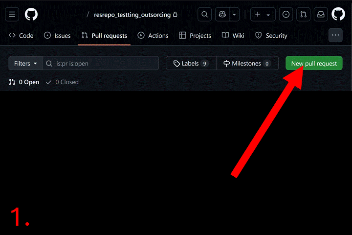

```{r setup, include = FALSE}
knitr::opts_chunk$set(
  collapse = TRUE,
  comment = "#>"
)
example_dir <- file.path(tempdir(), "resrepo_example")
unlink(example_dir, recursive = TRUE)
dir.create(example_dir, showWarnings = FALSE)

# create a subdirectory of example_dir
sub_dir <- file.path(example_dir, "subdir")
dir.create(sub_dir, showWarnings = FALSE)

example_repo <- git2r::init(sub_dir, branch = "main")
git2r::config(example_repo, user.name = "Test", user.email = "test@example.org")
vignette_dir <- getwd()
knitr::opts_knit$set(root.dir = sub_dir)
```

This vignette will cover the data versioning functionality of the
`resrepo` package, considering the following use cases:

-   Your data are too large to be stored in a git repository
-   You want to explore alternative workflows for your data analysis
-   You want to store your data externally

The function `version_setup` is used in each of these cases to create a
versioned repository that properly stores data. We begin in this way to maintain 
consistent structure of `resrepo` repositories.

-   'Setting up data versioning' illustrates how to use the function
    `version_setup` to create a versioned repository. This will prevent
    git from tracking data.

-   'Adding a new version' will show you how to explore alternative
    approaches to data analysis (e.g. a different version of data
    filtering). This section illustrates how to add new versions of the
    code and data, and merge branches.

-   'Outsourcing the data' demonstrates how to use `version_setup` to
    outsource your data storage to a different location, such as a
    folder synced to the cloud or a hard drive. You can still add new 
    versions and merge branches when outsourcing your data.
    
-   'Moving the versions' demonstrates how to use `version_relink` to move 
    your data to a different location (either locally or externally) once your 
    repository is already versioned. 

# Setting up data versioning

If your data is too big for GitHub and/or you want to version your data, we can 
use the function `version_setup`. 

This is the step where you need to decide where data will be 
stored (locally or externally). The command is the same, but depending on your 
choice, you will need to set the `resources_path` argument. 
By default, your data will be stored locally in your repository 
(but not tracked on GitHub). This is further explained in this section.
Instead, if you would like to mirror your data to a cloud repository 
(i.e. Dropbox, OneDrive) you can specify an external location for your 
data storage using the `resources_path` argument in `version_setup`. 
You might want to do this so that your data are backed-up, accessible 
from another machine, or to collaborators. 

You can always change the location of your data later, and you can refer to
the section below ('Moving the versions') for instructions on how to proceed.

You add versioning option to an existing `resrepo` repository using the
function `version_setup()`. 

We demonstrate this by using our example repository
from the vignette `workflow` - you might be already familiar with it. If
you still have that repository, you don't need to run the code below,
otherwise, let us start by recreating the `workflow` example repository:

```{r recreate_example_repo, results='hide'}
library(resrepo)
init_resrepo()
file.copy(
  from = system.file("vignette_example/tux_measurements.csv",
    package = "resrepo"
  ),
  to = path_resrepo("/data/raw/original/tux_measurements.csv"),
  overwrite = TRUE
)
file.copy(
  from = system.file("vignette_example/s01_download_penguins.Rmd",
    package = "resrepo"
  ),
  to = path_resrepo("/code/s01_download_penguins.Rmd"),
  overwrite = TRUE
)
knit_to_results(path_resrepo("/code/s01_download_penguins.Rmd"))
file.copy(
  from = system.file("vignette_example/s02_merge_clean.Rmd",
    package = "resrepo"
  ),
  to = path_resrepo("/code/s02_merge_clean.Rmd"),
  overwrite = TRUE
)
knit_to_results(path_resrepo("/code/s02_merge_clean.Rmd"))
file.copy(
  from = system.file("vignette_example/s03_pca.Rmd", package = "resrepo"),
  to = path_resrepo("/code/s03_pca.Rmd"),
  overwrite = TRUE
)
knit_to_results(path_resrepo("/code/s03_pca.Rmd"))
git2r::add(path = ".")
git2r::commit(message = "Set up", all = TRUE)
```

Let us check that we do have indeed a full repository:

```{r check_if_full_repo, echo=TRUE}
fs::dir_tree()
```

Here, we show the default option, where the `resources_path` argument is not specified. 
The function will automatically create the right set up of folders in
the expected order, including a subfolder named `versions` in your repository (locally).

```{r version_setup}
version_setup(quiet = TRUE, resources_path = NULL)
```

Let us check what happened:

```{r check_version_setup, echo=TRUE}
fs::dir_tree()
```


We can see that both `data/raw` and `data/intermediate` have been moved
into `versions`, `intermediate` is under the `initial` version, while
`raw` is under the `starting` directory. The function has also created
four metadata files: `intermediate_in_use.meta` and `raw_in_use.meta`
keep **track of the versions of data currently in use**, `initial.meta`
and `starting.meta` are, by default, the first version of the data.

In this vignette, we will be focusing only on versioning
`data/intermediate`. Therefore, `raw_in_use.meta` will point to the 
starting version of `data/raw` and will not change.

`data/intermediate` and `data/raw` have now become links, which is why
they are highlighted in a different colour (light purple) in the tree
above. We can use these links as if they were directories, and check
that they point correctly to the directories in `versions`.

```{r check_links}
dir(path_resrepo("/data/raw"))
```

However, note that the data are now NOT being tracked by git, as
`versions` is in .gitignore. So, you want to make sure that you have a
reliable way to back up your data.


# Adding a new version

We might now want to revise the filtering of data that we are doing.
This will affect some intermediate data and results. Whilst results are
tracked in the git repository, data are not. However, we might want to
compare the results of the alternative filtering approaches. We can use
the `version_add()` function to create a new version of the data, which
we can modify and compare to the `initial` version we created earlier.
It will also create a new branch in the git repository (with the same
name as the data version):

```{r version_add}
version_add(
  intermediate_new_version = "new_filtering",
  intermediate_description = "Filtering out some data"
)
```

We have called our new version `new_filtering`, and we can now see that
we have switched to a new branch in the git repository called
`new_filtering`, as indicated by (HEAD) below:

```{r}
git2r::branches()
```

Now `data/raw` and `data/intermediate` are symlinks to the
`new_filtering` version of the data, which is found under
`versions/new_filtering`. Each version will be under a new branch of the
repository.

A symlink is a link to a file or directory. When you access a symlink, it 
behaves as if you are accessing the target file or directory. 
This means that when you read from or write to a symlink, you are 
actually reading from or writing to the target file or directory.

It is also in theory possible to version `data/raw` by adding
"raw_new_version" to the `version_add` function, but this is NOT
RECOMMENDED, as raw data should ideally not be changed (it is supposed
to represent the data in their original format).

```{r check_version_add, echo=TRUE}
fs::dir_tree()
```

Imagine that we have just been told that the first 10 measurements of
the penguins might be considered unreliable, as the scales were showing
a low battery warning. We now will edit the code that merges and cleans
the data, and modify it to remove the first 10 penguins from the
dataset. We use a pre-prepared script for this, which we copy to the
`code` directory:

```{r copy_script_clean_data}
file.copy(
  from = system.file("vignette_example/new_filtering/s02_merge_clean.Rmd",
    package = "resrepo"
  ),
  to = path_resrepo("code/s02_merge_clean.Rmd"),
  overwrite = TRUE
)
```

If this was a "real" project, since the `new_filtering` version is a new
branch of the repository, we could edit the script in the `code`
directory and commit the changes.

We can now remove the full version of the intermediate dataset in the
`new_filtering` folder so that we can replace it with a new version that
excludes the first 10 penguins.

```{r remove_old_version}
fs::file_delete(path_resrepo("data/intermediate/s02_merge_clean"))
```

Note that `penguins_na_omit.csv` is still in the `versions/initial`
folder, as we have not removed it from `versions/initial` but only from
the `versions/new_filtering` directory.

```{r check_remove_old, echo=TRUE}
fs::dir_tree()
```

If we now knit the new version of the code, where we remove the first 10
penguins, the data are written to the
`versions/new_filtering/intermediate` directory.

```{r knit_new_filtering}
knit_to_results(path_resrepo("/code/s02_merge_clean.Rmd"))
```

```{r echo=TRUE}
fs::dir_tree()
```

We can now compare the datasets of our two versions, and we can see that
our current version of the data, which is found in `new_filtering`, has
10 fewer penguins than the `initial` version.

```{r compare_versions}
penguins_new_filtering <- read.csv(path_resrepo(
  "data/intermediate/s02_merge_clean/penguins_na_omit.csv"
))

penguins_initial <- read.csv(path_resrepo(
  "/versions/initial/intermediate/s02_merge_clean/penguins_na_omit.csv"
))

nrow(penguins_initial)
nrow(penguins_new_filtering)
```

# Merging back into main

If we are happy with the new version, we can merge it back into the main
branch. This will mean that our branch `main` will now use the new
version of the data (with the 10 less penguins). At the same time, this
means that we will replace the previous code with the code in the new
branch. You may want to keep both versions of the code if you are
interested in using both versions of the data. If we are absolutely sure
about merging back into the main branch, before doing it, we need to
commit the changes to the branch `new_filtering`.

How to commit in RStudio:

::: {style="text-align: center; margin-top: 10px; margin-bottom: 10px;"}

:::

```{r git_commit, eval=T, echo=FALSE, message=FALSE, results='hide'}
# commit changes
git2r::commit(message = "Filter out 10 penguins", all = TRUE)
```

Now we can merge the branch `new_filtering` into the branch `main`, and
check out `main`. To do this, we can use the GitHub interface, following
the steps below.

First, we need to push both branches to GitHub:

::: {style="text-align: center; margin-top: 10px; margin-bottom: 10px;"}

:::

Now go to your repository page on GitHub. Click the "Pull requests" tab.
Then click the "New pull request" button and select base branch (e.g.,
`main`) and compare branch (e.g., `new_filtering`). Click "Create pull
request", and add a description. Click "Merge pull request" to complete
the merge. Now you can delete the `new_filtering` branch.

::: {style="text-align: center; margin-top: 10px; margin-bottom: 10px;"}

:::

```{r git_merge, eval=T, echo=FALSE, results='hide'}
# merge in branch
system2("git", args = c("merge new_filtering"))

# checkout main
system2("git", args = c("checkout main"))

# we are still in main
git2r::is_head(git2r::branches()$main)
```

And now we have successfully versioned and updated our repository.

# Outsourcing the data

In this section, we demonstrate how to use the `version_setup` function to outsource your data. 

```{r recreate_example_repo_02, include = FALSE}
unlink("*", recursive = TRUE)
example_repo <- git2r::init(".", branch = "main")
git2r::branches()
```

Often, you may want to outsource your data so that it is backed up, accessible 
from another machine, or easily shared with collaborators.
In such cases, you might want to store your data in a different location, 
such as a cloud repository (e.g. Dropbox, OneDrive) that mirrors your data files.
You can specify an external location for your data storage using the 
`resources_path` argument in `version_setup`.

**NOTE**: Make sure that you have enough space on your hard drive before 
versioning: if you are using a cloud service, a full copy of your data will also
be stored  locally on your hard drive, which reduces the available storage space. 
If there is not enough space, the new version will not be created.

We only use the `version_setup` function once. If you want to outsource data from
an already versioned repository, please follow the 'Moving the versions' section below.

For this example, we first create a new (empty) repository that does not yet 
have any versioning:

```{r init_resrepo, results='hide'}
init_resrepo()
```

We now need to create a folder for data storage in our desired external
location.

```{r create_external_folder, echo=TRUE}
external_data_storage <- file.path(tempdir(), "external_data_storage")
dir.create(external_data_storage)
```

For the purpose of this vignette, the above folder is created in a
temporary location. For your project this could be a directory on a hard drive, 
or a folder synced to the cloud.

Now we have an empty folder where we want to store our data, and an
empty repository for our project.

This time to set up versioning with external data storage, we will use the 
function `version_setup`, however, we will set the argument
`resources_path` to the external path where we would like to store the
new versions of our data.

We use the same `version_setup` function to set up versioning and 
we now specify the external path using the `resources_path` argument.

```{r version_setup_external}
version_setup(quiet = TRUE, resources_path = external_data_storage)
```

We can now check that the repository has been set up correctly and we
see that `external_data_storage` is not found in the tree of our
repository:

```{r check_external_setup, echo=TRUE}
fs::dir_tree()
```

However, the `data/raw` and `data/intermediate` directories are now
symlinks to the `external_data_storage` folder, which is where the
versions of our data will be stored.

We can see the structure of our external data storage folder looks like
this:

```{r check_external_storage, echo=TRUE}
fs::dir_tree("../../external_data_storage")
```

We can now populate our repository with the necessary scripts.

```{r copy_scripts_external}
file.copy(
  from = system.file("vignette_example/s01_download_penguins.Rmd",
    package = "resrepo"
  ),
  to = path_resrepo("/code/s01_download_penguins.Rmd"),
  overwrite = TRUE
)
file.copy(
  from = system.file("vignette_example/s02_merge_clean.Rmd",
    package = "resrepo"
  ),
  to = path_resrepo("/code/s02_merge_clean.Rmd"),
  overwrite = TRUE
)
file.copy(
  from = system.file("vignette_example/s03_pca.Rmd", package = "resrepo"),
  to = path_resrepo("/code/s03_pca.Rmd"),
  overwrite = TRUE
)
```

And add our data:

```{r copy_data_external}
file.copy(
  from = system.file("vignette_example/tux_measurements.csv",
    package = "resrepo"
  ),
  to = path_resrepo("/data/raw/original/tux_measurements.csv"),
  overwrite = TRUE
)
```

We can now run our scripts:

```{r run_scripts_external}
knit_to_results(path_resrepo("/code/s01_download_penguins.Rmd"))
knit_to_results(path_resrepo("/code/s02_merge_clean.Rmd"))
knit_to_results(path_resrepo("/code/s03_pca.Rmd"))
```

When we view the git repository we can now see all our results files:

```{r check_knitted_external, echo=TRUE}
fs::dir_tree()
```

And the data are successfully stored in our external folder:

```{r check_external_storage_knit, echo=TRUE}
fs::dir_tree("../../external_data_storage")
```


# Moving the versions

Once you have versioned your repository, if you want to move your data somewhere else 
and update the links to the new location, you will need to move the `versions` folder 
to the new location, and then re-run `version_relink` with `resources_path` set to the new path.

```{r move_versions_folder, echo=TRUE}
# create another external data storage folder
new_external_data_storage <- file.path(tempdir(), "new_external_data_storage")

# create new data directory where we want to move our data
dir.create(new_external_data_storage, showWarnings = FALSE)

# move versions folder to new_data_dir
file.rename(
  from = "../../external_data_storage/versions",
  to = file.path(new_external_data_storage, "versions")
)

fs::dir_tree(new_external_data_storage)


# relink the version
version_relink(quiet = TRUE, resources_path = new_external_data_storage)
```

Now we have a symlink for `versions` in our repository, which points to the new location of our data.

```{r check_version_relink, echo=TRUE}
fs::dir_tree(new_external_data_storage)
fs::dir_tree()
```

```{r check_writing_file, echo = TRUE}
# write a text file to ../data/raw/original to check the link works
write.csv("blah", path_resrepo("/data/raw/original/my_new_file1.csv"),
  row.names = FALSE
)

fs::dir_tree(new_external_data_storage)
```

