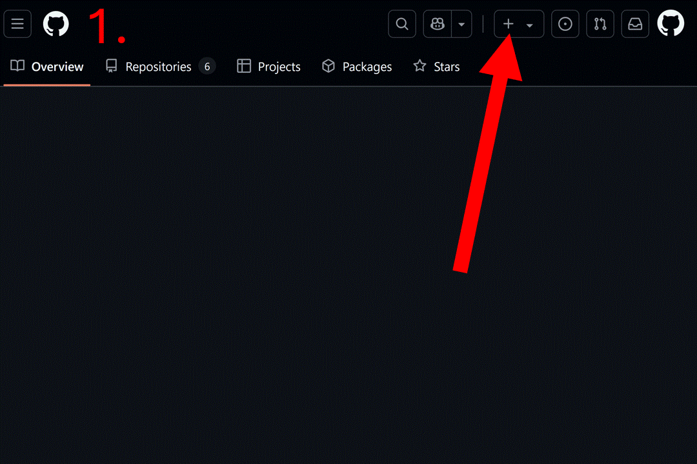
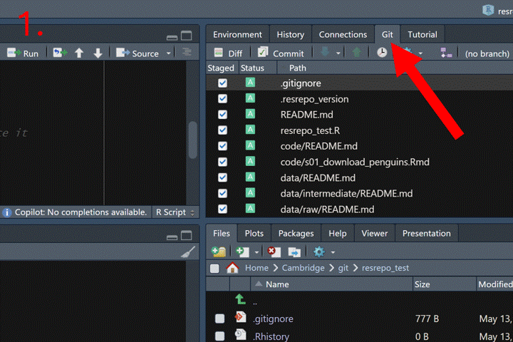

```{r setup, include = FALSE}
knitr::opts_chunk$set(
  collapse = TRUE,
  comment = "#>"
)
example_dir <- file.path(tempdir(), "resrepo_example")
unlink(example_dir, recursive = TRUE)
dir.create(example_dir, showWarnings = FALSE)
example_repo <- git2r::init(example_dir)
git2r::config(example_repo, user.name = "Test", user.email = "test@example.org")
vignette_dir <- getwd()
knitr::opts_knit$set(root.dir = example_dir)
```

# resrepo: easy research on git

The aim of `resrepo` is to encourage and facilitate good practices when setting up and managing `git` repositories for scientific research projects. There are three main elements to this: 

* it provides a **template for a tidy repository structure** that can be used for any project, with functions that help keeping a clear separation of code, data and results.
* it provides functionality to help **manage large data** that cannot be tracked on a git repository. This is achieved through **versioning the data and results** with the use of symlinks, allowing easy comparison of different versions (e.g. different data filtering) and enabling the storage data outside the git repository, potentially in directories that are backed up on the cloud. 

## General overview

In `resrespo`, we keep data, code, results, and the write-up separate. This 
allows for a tidy structure that can flexibly accommodate very complex projects.
Note that there are a number of README.md files, which provide instructions and advice
related to the files that go into that particular directory.

If you created the repository with `init_resrepo`, the function will automatically commit these changes for you, so that you have a clean repository template as your first commit, and you
can best document the changes that you make as you progress.

### resrepo template

The first way in which *resrepo* can facilitate good practices when managing git repositories, is to structure your folders so each type of file has their specific location. This helps to separate your data from your code (which is good coding practice) and creates an easy to navigate file structure for all your output.

Here is a general overview of the structure:

* **code**: this is, unsurprisingly, the folder for your code, which may be in R, or other languages if needed. 
* **data**: `resrepo` will automatically create a *data* folder that contains two subfolders: *raw* is intended for your raw/initial set of data, needed to start running the analyses. *intermediate*, instead, is where most outputs should go (e.g., modifications of the raw data, tables, plots, intermediate input files). Because these folder may end up including huge files, by default the content of "data" will not be uploaded to GitHub, as it is automatically added to `.gitignore`. 
* **results**: this folder should only be reserved for final files (e.g, summary tables, plots) that are intended for publication. Because this folder is intended for a limited number of small files, it is expected to be uploaded on GitHub.
* **writing**: this folder is intended for the write-up of your project. It can contain markdown files, or links to GoogleDocs or Word documents. It is not recommended to store large files in this folder.


## Naming your code scripts

The names of your scripts should be informative and follow a logical order. We recommend
that you use a prefix to indicate the order of the scripts, such as `s01`, `s02`, etc.,
with an underscore separating a short but descriptive title. Avoid spaces (they should
be replaced with underscores) and capital letters (not all file systems/languages are case
sensitive). For example, a script
that downloads remote sensing data from a public server could be named `s01_download_remote_sense.Rmd`.
A script to run a clustering analysis from the data could be named `s02_clustering.Rmd`.
Avoid naming your files starting with a number (e.g. instead of “01_process_data.R” use “s01_process_data.R”)
Do not use generic names such as “Figure_01”, “Figure_02”, etc. for your files and folders. Use more descriptive names as numbers change. It will make your life easier when you will need to work again on the project.


## Set up data directories

For most projects, you will need some data for your scripts to work. There are 
two main categories of data: "raw" data, which are primary data (e.g. 
measurements you made in the lab or the field, FASTQ files generated by a 
sequencer, remote sensing data downloaded from NASA); and "intermediate" data 
(data that you generated from raw, and that in turn will be used as the base of
further analysis). 

In `resrepo`, we store data in one or more sub-directories 
within `/data/raw` or `/data/intermediate`, depending on their category. 
The template has a `/raw/original` subdir, which you could use if you have a 
simple project with relatively
few data files, but you are free to remove it and create alternative ones. For data that
you collected or generated, you can use any name (e.g. `data/raw/fastq`, 
`data/raw/focal_obs`, etc.). If data are generated by a script, then they should be
placed in a subdirectory with the same name of that script, implicitly documenting
their provenance. So, if you downloaded
data from a remote server in a script called `s01_download_remote_sense.Rmd`, the data
should be stored in `/data/raw/s01_download_remote_sense`. If you generated data in a script
called `s02_clustering.Rmd`, the data should be stored in `/data/intermediate/s02_clustering`.
Feel free to have further subdirectories within these directories if you have a large
amount of data.

No files should be stored directly in `/data/raw` or `/data/intermediate`, 
they should always be put in a first level sub-directory. If you are not 
generating any intermediate data, you can simply ignore the `/data/intermediate` directory.

## Generating results
Some analyses will generate outputs that we want to use in the paper (e.g. plots or tables).
We suggest that you put those in the `results` directory, to separate them from intermediate
data (which are generally used for further analysis). As with data, we suggest that you
create a subdirectory for each script that generates results. So, if you have a script
`s02_clustering.Rmd` that generates a plot, you should save that plot in 
`/results/s02_clustering`. In this example, the same script could generate both a large
amount of data describing the membership to clusters (which we decided to store as data) and a plot
(which belongs in results). There are many instances where the same output could be
thought as either data or results; don't worry too much about it, as long as you annotate
your code well, you will be able to find where the information is.


## Writing it all up

Git is not really designed to handle Word or OpenOffice files. Ideally, text is 
kept in markdown files, but that format does not lend itself nicely to formatting
for submission (e.g. bibliography from a reference manager). Having said that, 
you could, in principle, track Word/OpenOffice documents in the `writing` directory, 
as they are rarely large enough to cause trouble. If you are writing
collaboratively, you are more likely to use GoogleDoc or shared Word documents.
In that case, you can use the README.md in the `writing` directory to store the 
paths to those documents. By doing so, it means that a collaborator who has access 
to the repository can also find the manuscript easily (i.e.
everything is in one place).

## Initialise the repository

Start by creating a blank repository on GitHub (or equivalent server), and clone it on your computer. Instructions to do so can be found at [this link](https://happygitwithr.com/new-github-first#new-github-first) or you can follow the gif below. For this vignette, we will create a "resrepo_example" git repository. 

<div style="text-align: center; margin-top: 10px; margin-bottom: 10px;">
  
</div>

Then, you can clone the repository on your computer. You can do this in RStudio by clicking on the *File* tab, then *New Project...*, *Version Control*, *Git*, and pasting the URL of your repository. 

We will now use `resrepo` to initialise the repository. First, make sure that your working directory is set within the `git` repository:
```{r}
getwd()
```

We can now initialise the repository:
```{r}
library(resrepo)
init_resrepo()
```

Let us look at the content of our new repository:

```{r}
fs::dir_tree()
```

You should now modify the main README.md, found at the root of the project,
to describe your project. That document will act as the landing page of your
git repository in GitHub/GitLab.


## Similar tools

Scientific projects contain both code and data: `git` is designed to manage software code, but it is not suited to track large data files. There are extensions of `git`, such as `git-lfs` and `git-annex` that can handle data, but they can be complex to set up and difficult to use, especially when sharing your repository among collaborators. `resrepo` encourages good habits to manage your data alongside your code in plain `git`, making it easy to share your project with collaborators, thus ensuring reproducible science and a tidy repository that can used for publication of your work.

<br>

***

<br>

# A step by step example

We will now illustrate how to populate a simple project with `resrespo`.

In this project, we have gone to the field and measured several individuals of
a new imaginary species of penguin called Tux. We have collected data on their bill length and depth, flipper length,
body mass and sex. We will store this data, of which we have a copy in the package, as a CSV file named "tux_measurements.csv"
in the `data/raw/original` directory:

```{r}
file.copy(
  from = system.file("vignette_example/tux_measurements.csv",
                     package = "resrepo"),
  to = path_resrepo("/data/raw/original/tux_measurements.csv"),
  overwrite = TRUE
)
```

Let's have a look at the repository:
```{r}
fs::dir_tree()
```

We will then write a script to download data on three other species of penguins from the `palmerpenguins`
dataset. We will call this script `s01_download_penguins.Rmd`, and store the data in `data/raw/s01_download_penguins`. 

`resrepo` can generate a pre-edited Rmd file for you to use as a template for your analysis
. This is better than the default template in RStudio, and we will explore some of its additional
features further below. To create a new Rmd file from the `resrepo` template Rmd file, use the `create_rmd` 
function and specify the file name and which folder it should be in (you do not 
need to include the `.Rmd` file extension).


```{r}
create_rmd("code/s01_download_penguins")
```

We can replace the explanatory text and examples in this Rmd with only a simple chunk of code:
```{r eval = FALSE}
library(resrepo)
# define the output directory (named after the script) and create it
output_dir <- path_resrepo("/data/raw/s01_download_penguins")
if (!dir.exists(output_dir)) {
  dir.create(output_dir, recursive = TRUE)
}
# load the data
data("penguins", package = "palmerpenguins")
# write the data
write.csv(
  x = penguins, file = file.path(output_dir, "palmer_penguins.csv"),
  row.names = FALSE
)
```

Note that, to set the output directory, we used the function `path_resrepo`, which
allows us to use paths relative to the root of the git repository, irrespective 
of where the scripts are. Alternatively, you could use a relative path from the 
script, e.g. `../data/raw/s01_download_penguins`. The `..` means "go up one directory", 
so from the `code` directory, it would go to the root of the repository, then 
into `data/raw/s01_download_penguins`. If you want more information on relative paths,
have a look at this [link](https://www.redhat.com/en/blog/linux-path-absolute-relative).

Add the chunk above to our s01_download_penguins.Rmd and save it.

```{r echo=FALSE, results="hide"}
file.copy(
  from = system.file("vignette_example/s01_download_penguins.Rmd",
                     package = "resrepo"),
  to = path_resrepo("/code/s01_download_penguins.Rmd"),
  overwrite = TRUE
)
```

We can see the script in the `code` directory:
```{r}
fs::dir_tree()
```

You can now open the Rmd and knit it to download the data.
```{r, echo=F, results='hide'}
knit_to_results(path_resrepo("/code/s01_download_penguins.Rmd"))
```

We can see that the data was saved in the right place:
```{r}
fs::dir_tree()
```

Note that knitting our Rmd also created the new directory `results/s01_download_penguins` 
to store the knitted markdown. Standard Rmd documents save the outputs in the same directory as the code, which would break the rule of separation of code and outputs. To avoid this, rmd documents created with `resrepo::create_rmd()`, have their knitted output stored in the right place in results by default. In this case, this document is pretty minimal (it just repeats the 
code used to download and save), but later on we will use it to document our analysis.

Now that we have new files (the code to download and the resulting data and output), we should commit
our changes to the repository. In RStudio, open the *Git* tab on the right-hand side, click the *Commit* button, write a descriptive commit message, and then click *Commit* to finalize.


<div style="text-align: center; margin-top: 10px; margin-bottom: 10px;">
  
</div>

```{r echo=FALSE, results="hide"}
git2r::add(path = ".")
git2r::commit(message = "Added preprocess script", all = TRUE)
```

We now want to merge our data on the new species with the reference dataset, 
and clean the data (e.g. remove missing data). We will copy over an Rmd from 
the package, which was originally created with `resrepo::create_rmd`: 

```{r}
file.copy(
  from = system.file("vignette_example/s02_merge_clean.Rmd",
                     package = "resrepo"),
  to = path_resrepo("/code/s02_merge_clean.Rmd"),
  overwrite = TRUE
)
```

We can check that the script is in the right place:
```{r}
fs::dir_tree()
```

Have a look at this Rmd document. Note how we set all input paths at the very
beginning of a script, so that it is easy to know what is needed to run
that script. This habit makes it much easier to share the script with others.

You can now knit the Rmd to merge the data and clean it. 
```{r knit_merge_clean, echo=F, results='hide'}
knit_to_results(path_resrepo("/code/s02_merge_clean.Rmd"))
```

We can see that the data was saved in the correct `/data/intermediate` subdirectory:
```{r}
fs::dir_tree()
```

Again, note that a markdown output was placed in an appropriate subdirectory of `results`.

We are now ready to do some analysis. We will start with a PCA, with the aim of testing
whether our tux penguin is clearly distinct from other penguin species. We use a script
from the package, which we copy over to our repository:

```{r}
file.copy(
  from = system.file("vignette_example/s03_pca.Rmd", package = "resrepo"),
  to = path_resrepo("/code/s03_pca.Rmd"),
  overwrite = TRUE
)
```

Open it. Again, note our input and output paths are all set at the top of the script,
to make it easy to understand what is needed to run the script. 
You should now run (knit) your script. 
```{r, echo=F, results='hide', message=FALSE}
knit_to_results(path_resrepo("/code/s03_pca.Rmd"))
```

Let's check the repository once again:
```{r}
fs::dir_tree()
```

Now you just need to commit your changes as you did above, and we have a full repository with data, code
and results, with a clear structure that should be easy to interpret.
```{r echo=FALSE, results="hide"}
git2r::add(path = ".")
git2r::commit(message = "Save plot", all = TRUE)

git2r::status()
```


### Some tips on how to use GitHub


**Commit**
Think carefully about your commit messages and branch names, as they will be very useful for returning to past changes for both you and others (for example when a project is made publicly available). Please make them informative.  

**Merge**
Once you merge a branch into master, kill the branch to avoid problems in the future.
Do not name a branch with the name of a branch that has been merged/deleted recently, as this may create problems. 

**Binary files**
Do not upload binary data (e.g.*.rds): changes in such files are too heavy to be handled by GitHub.  

## GitHub setup
If you already have a ssh key, follow these steps:
https://docs.github.com/en/authentication/connecting-to-github-with-ssh/checking-for-existing-ssh-keys 

If you need to generate a new key and add it to GitHub:
**1. Generate ssh key**
Source: https://docs.github.com/en/authentication/connecting-to-github-with-ssh/generating-a-new-ssh-key-and-adding-it-to-the-ssh-agent

**2. add key to account**
Source: https://docs.github.com/en/authentication/connecting-to-github-with-ssh/adding-a-new-ssh-key-to-your-github-account  

**3. Test connection**
Source: https://docs.github.com/cn/authentication/connecting-to-github-with-ssh/testing-your-ssh-connection  

